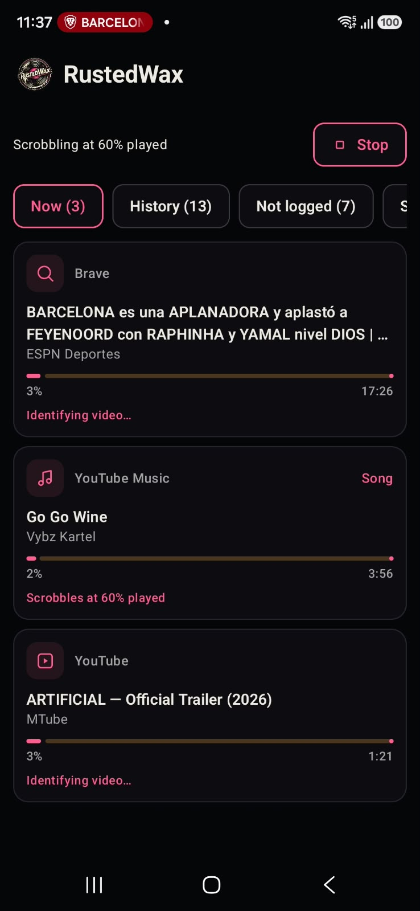
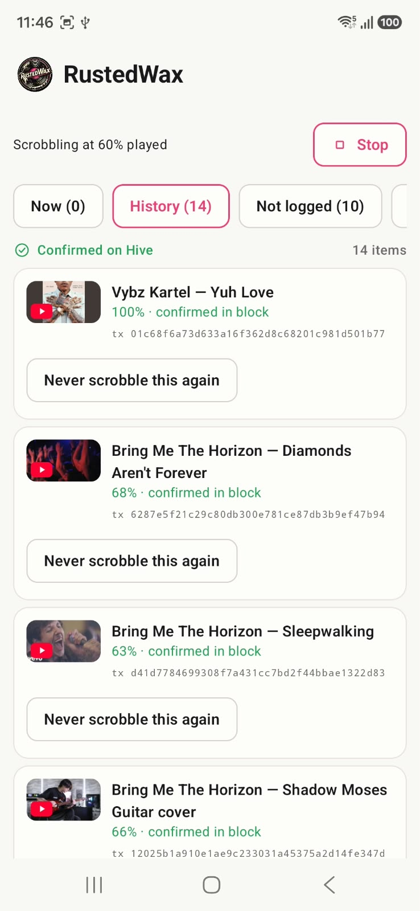
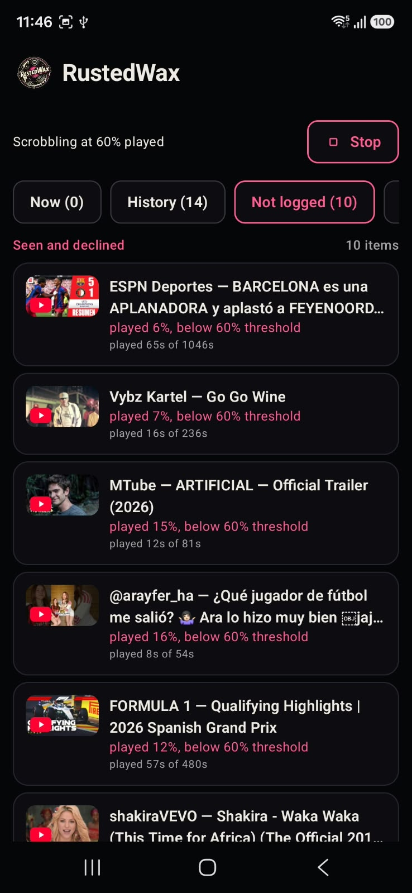
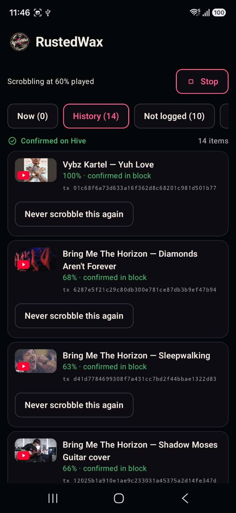
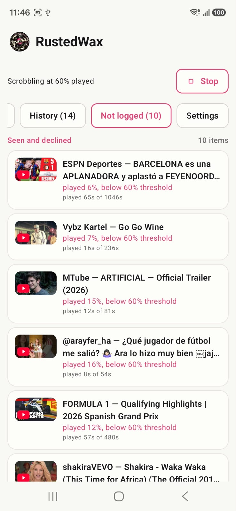
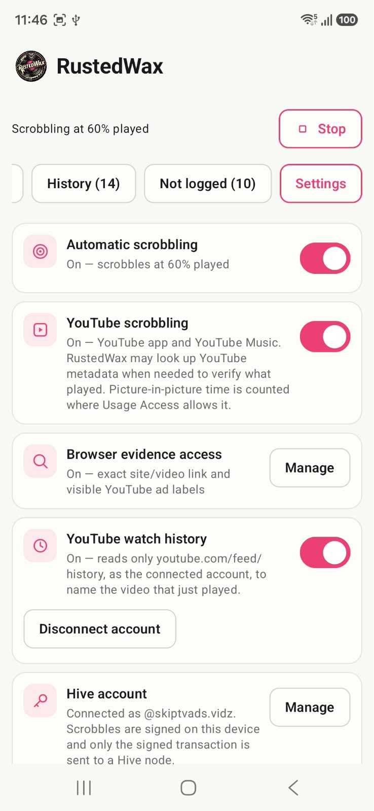

<p align="center">
  
</p>

<h1 align="center">RustedWax</h1>

<p align="center">
  <strong>Android scrobbling for Hive.</strong><br>
  Turn verified YouTube listens into a listening history on the Hive blockchain.
</p>

RustedWax observes playback from YouTube, YouTube Music, Brave, and Chrome. It
measures played time, verifies the video, and signs eligible Hive transactions
locally on the Android device.

## Download

The current public release is **RustedWax v0.11.2**.

1. Open the [latest GitHub Release](https://github.com/rustedcomet/RustedWax-Android/releases/latest).
2. Download `rustedwax-v0.11.2-release.apk`.
3. Optionally verify it against the published
   [release identity and checksum](Documentation/Product/RELEASE_VERIFICATION.md).
4. Install it on Android 8.0 or newer and follow the
   [setup guide](Documentation/Product/SETUP.md).

Regular users should install the signed release APK, not a debug build.

## Features

- Measures actual played time, including playback-speed changes.
- Requires a verified YouTube video identity before an on-chain write.
- Supports native YouTube, YouTube Music, and YouTube in Brave or Chrome.
- Can count eligible foreground Shorts and picture-in-picture time when the
  corresponding optional Android access is granted.
- Shows successful broadcasts and clear refusal reasons.
- Keeps diagnostic logging optional, bounded, and off by default.
- Signs Hive transactions on-device.

## Screenshots

<p align="center">
	
	
	
</p>

<p align="center">
	
	
	
</p>

The gallery shows owner-approved real usage, including public Hive activity.
It contains no passwords or key material.

## Account safety

Use only a Hive posting key. Never enter a Hive active key, owner key, master
password, or seed phrase. RustedWax protects the saved posting key with Android
encrypted storage, but a posting key can still post, comment, and vote for its
account. A separately revocable posting-authority key is the safest choice.

The optional YouTube watch-history connection stores an encrypted session on
the device. Read the in-app disclosure before connecting it.

## Documentation

- [Setup and permissions](Documentation/Product/SETUP.md)
- [How RustedWax works](Documentation/Product/HOW_IT_WORKS.md)
- [Detection sources](Documentation/Product/DETECTION.md)
- [Identity and verification](Documentation/Product/IDENTITY.md)
- [Scrobbling rules](Documentation/Product/SCROBBLE_RULES.md)
- [On-chain format](Documentation/Product/ON_CHAIN_FORMAT.md)
- [Known limitations](Documentation/Product/LIMITATIONS.md)
- [Testing](Documentation/Testing/TESTING.md)
- [Contributing](CONTRIBUTING.md)
- [Security policy and known security limitations](SECURITY.md)

## Build from source

Install Android Studio with JDK 17 and an Android SDK, then run:

```bash
export ANDROID_HOME=/path/to/android-sdk
export JAVA_HOME=/path/to/jdk-17
./gradlew :app:assembleDebug
```

The debug APK is written under `app/build/outputs/apk/debug/`.

RustedWax uses some unsupported YouTube web-page and metadata interfaces. They
can change or stop working without notice. RustedWax is independent and is not
affiliated with Hive, scrobble.life, Hive Scrobbler, Web Scrobbler, Google, or
YouTube.

[MIT licensed](LICENSE).
