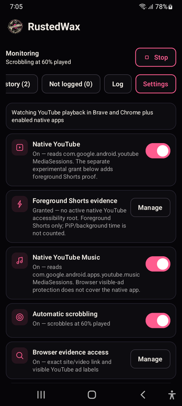

<p align="center">
  
</p>

<h1 align="center">RustedWax</h1>

<p align="center">
  <strong>Android scrobbling for Hive.</strong><br>
  Turn verified YouTube listens into a listening history on the Hive blockchain.
</p>

RustedWax watches playback from **YouTube**, **YouTube Music**, and YouTube in
**Brave or Chrome**. It measures what was actually played, verifies the video,
and signs the Hive transaction locally on your phone.

## Features

- Measures real playback instead of assuming that an open player means a listen.
- Requires verified video identity before anything is written on-chain.
- Shows confirmed scrobbles with their Hive transaction IDs.
- Lists tracks it refused to scrobble and explains why.
- Protects your posting key with Android Keystore and signs locally.
- Supports light and dark themes.

## Install

> RustedWax is currently a prototype built from source. There is no public
> signed release yet.

1. Clone this repository and build the debug APK:

   ```bash
   ./gradlew :app:assembleDebug
   ```

2. Install `app/build/outputs/apk/debug/app-debug.apk` on your Android device.
3. Add your Hive username and **posting key**, then grant Notification Access.

Never enter an active or owner key. Optional browser, Shorts, and picture-in-picture
grants are explained in the [setup guide](Documentation/Product/SETUP.md).

## Screenshots

<p align="center">
  
  
  
</p>

## Documentation

Architecture, behavior rules, field reports, testing evidence, development guidance,
and the roadmap are available in the **[full documentation](Documentation/README.md)**.

The rule that decides whether a listen may be written at all is the
[Video identity contract](Documentation/Product/IDENTITY.md): nothing reaches the
chain without a verified video id, and an ambiguous or contradicted one fails
closed rather than picking a plausible candidate.

---

RustedWax is personal prototype software. It is not affiliated with or supported by
scrobble.life, Hive Scrobbler, or Web Scrobbler.

[MIT licensed](LICENSE).
